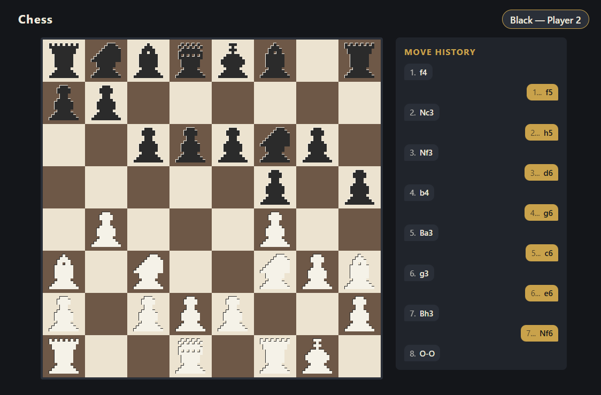
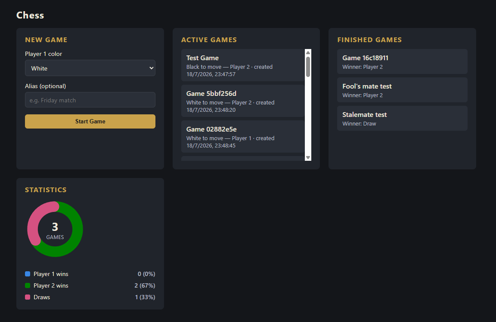

# Chess Web

A local **hotseat** (two players, same computer, turn-by-turn) chess game.
There is no online play, no accounts, and no authentication.

- **Backend:** Flask + [`python-chess`](https://python-chess.readthedocs.io/)
  (all rule validation) + SQLAlchemy over SQLite.
- **Frontend:** vanilla HTML/CSS/JS, no framework, no build step.

See `docs/PRD.md` and `docs/TECH_DESIGN.md` for the full product and
architecture spec.

## Requirements

- Python 3.10+

## Install

Clone the repository, create a virtual environment, and install the
dependencies:

```bash
git clone <repo-url>
cd chess-web
python -m venv .venv
```

Activate the virtual environment:

```bash
# Windows (PowerShell)
.venv\Scripts\Activate.ps1

# Windows (Git Bash) / macOS / Linux
source .venv/Scripts/activate   # Git Bash
source .venv/bin/activate       # macOS / Linux
```

Install dependencies:

```bash
pip install -r requirements.txt
```

## Run

Start the Flask server from the `backend/` directory:

```bash
cd backend
python app.py
```

The app serves both the API and the frontend on
[http://localhost:5000](http://localhost:5000). A `games.db` SQLite file is
created automatically in the repo root on first run.

Open [http://localhost:5000](http://localhost:5000) in a browser to play.

## Play

1. In the **New Game** panel, pick Player 1's color (Player 2 gets the
   other) and an optional alias, then click **Start Game**.
2. Click a piece belonging to the side to move to highlight its legal
   destinations, then click a highlighted square to play the move.
3. When a pawn reaches the last rank, choose the piece to promote to
   (Queen, Rook, Bishop, or Knight).
4. Check, checkmate, stalemate, and other draws are announced with a
   banner; the board locks once a game finishes.
5. Use **Lobby** to switch between concurrent games, review finished
   games (winner only), and see overall Player 1 / Player 2 / draw
   statistics.

Board orientation is fixed with White at the bottom for both players.

## Screenshots

| Board & move history | Lobby & statistics |
| --- | --- |
|  |  |

## Tests

Run the test suite from the repo root:

```bash
pytest
```

Run a single test:

```bash
pytest tests/test_chess_service.py::test_name
```

## Smoke check

With the server running:

```bash
curl localhost:5000/api/health
```

should return `{"status":"ok"}`.
